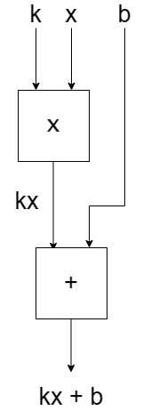
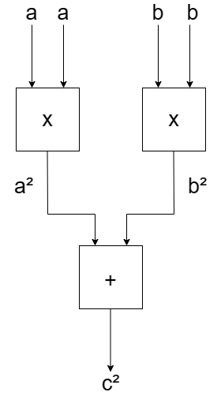
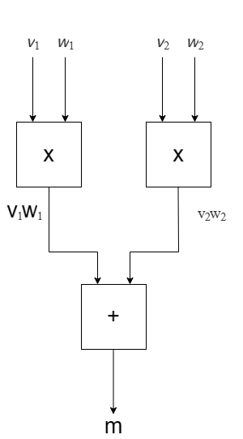

# Homework 1

## T1

1. 解

   - -144\
     原码：1111 1111\
     反码：1000 0000\
     补码：1000 0001\
     从而其八位二进制补码为：1000 0001
   - +81\
     原码：0101 0001\
     反码：0101 0001\
     补码：0101 0001\
     从而其八位二进制补码为：0101 0001

2. 解

   - 0011 0010\
     符号位为 0，该数为正数，其原码也为 0011 0010，\
     故其十进制表示为：+50

   - 1111 1101\
     符号位为 1，该数为负数\
     反码：1111 1100\
     原码：1000 0011\
     从而其十进制表示为：-3

## T2

1.  解\
    一个八位二进制补码可以表示的最小和最大的数用十进制分别表示为-128 和 127。

        - 对于最大的数，二进制表示为0111 1111，这在十进制中等于127。
        - 对于最小的数，二进制表示为1000 0000，这在十进制中等于-128。

2.  解\
    N 位二进制补码可以表示的范围是从 $-2^{(N-1)}$ 到 $2^{(N-1)} - 1$。

        - 对于最大的数，二进制表示为01...1（N-1个1）。
        - 对于最小的数，二进制表示为10...0（N-1个0）。

        例如，对于8位二进制补码，范围是从-128到127。

## T3

$\qquad$解： -128

    有负整数具有相同的2的补码表示和二进制（8位）的原码。这个数是-128。

    在8位二进制中，-128的原码和补码都是1000 0000。

    在原码中，最高位（符号位）为1表示这是一个负数，其余位（数值位）表示128。

    在补码中，负数的表示方法是取其绝对值的二进制表示，然后对其进行反码（即每一位取反），
    最后加1。

    但是对于-128，其绝对值的二进制表示就是1000 0000，取反后仍然是1000 0000，
    加1后溢出，仍然是1000 0000。因此，-128的原码和补码在8位二进制中是相同的。

## T4

1.  解：

    $\qquad$当输入的数不是整数时，可能会出现题目中的情况。

        在 C 语言中，int 类型的范围通常是 -2147483648 到 2147483647，
        如果输入的整数超过这个范围，那么可能会发生溢出，导致程序的行为变得不可预测。

        但是，本题中已经保证输入的数字在int的范围内，故排除上面的情况。

        除上面的情况外，如果输入的不是整数，例如字符串或浮点数，
        那么 scanf 函数可能无法正确地解析这些输入，导致 a 和 b 的值不可预测。

        例如，经过测试：
            当输入的值为 a = 1.5 , b = 1.4 时，程序输出a < b，但实际上a > b
            当输入的值为 a = b   , b = a   时，程序也输出a < b

        故：当输入的值不是整数时，程序输出a < b，但实际上a ≥ b

2.  解：

    $\qquad$当输入正浮点数时，可能会出现与 1 中相同的情况。

        这段代码有以下两点问题。

        首先，错误地使用了 '%d' 格式说明符来读取  'unsigned int'  类型的变量，
        这可能会导致未定义的行为。应该使用%u来读取unsigned int类型的变量。

        其次，错误地对  'unsigned int'  类型的变量进行取负操作。
        在C语言中，对无符号类型进行取负操作是未定义的行为，可能会导致不可预测的结果。
        如果需要比较两个无符号整数的大小，应该直接比较它们，而不是比较它们的负值。

        经测试，在我的电脑环境下，正常输入时可以得到正常的结果，
        若输入小数会出现异常情况
        （输入正小数时，程序只会输出a < b ；输入负小数时，程序只会输出 a ≥ b ）

        故： 当输入正浮点数时，可能会出现与1中相同的情况

## T5

给定的数是：0 10001011 00000000001000000001000
其从前往后依次为： 符号位，指数位，尾数位

- 符号位是 0，表示这个数是正数。
- 指数是 10001011，转换为十进制是 139。实际的指数是通过从这个数中减去 127（单精度数的偏移量）来计算的，所以实际的指数是 e = 139 - 127 = 12。公式如下：
  $$
  \begin{aligned}
    &|E| = 128 + 8 + 2 + 1 = 139\\
    &e = |E| - bias\\
    &bias = 2^{k -1} - 1 = 2^7 - 1 = 127
  \end{aligned}
  $$
- 尾数是 00000000001000000001000，表示的二进制小数是 1.00000000001000000001000（在 IEEE 754 表示法中，1.是隐含的）即：

  $$
    m = |1.M|
  $$

  所以，给定的 IEEE 浮点数的十进制等效值是：4096.999755859375

  $$
  \begin{aligned}
  &(-1)^{符号位} \times 2^{指数} \times 1.尾数\\
  &= (-1)^0 \times 2^{12} \times 1.00000000001000000001000\\
  &= 1 \times 4096 \times 1.000244140625\\
  &= 4096.999755859375
  \end{aligned}
  $$

### T8

1.  填充得到的代码如下：

        void swap(int *a, int *b) {

            *a = *a ^ *b;   // 计算*a和*b的XOR，并将结果存储在*a中。

            *b = *a ^ *b;   // 实际上计算的是(*a ^ *b) ^ *b，这简化后就是*a，
                            // 并将结果存储在*b中

            *a = *a ^ *b;   // 将*a（仍然是*a ^ *b）和*b（现在是原来的*a）进行XOR运算，
                            // 实际上计算的是(*a ^ *b) ^ *a，这简化后就是*b，
                            // 并将结果存储在*a中
        }

2.  修改得到的代码如下：

        void sort(int *a, int n){
            //sort a[0] ~ a[n-1]
            for(int i = 0; i < n-1; i++){
                int min = i;
                for(int j = i; j < n; j++){
                    if(a[j] < a[min])
                        min = j;
                }
                if(a[i] != a[min]) {        // 改动处一
                    swap(&a[i], &a[min]);   // 改动处二
                }
            }
        }

    - 首先，结合上一题，当 i 和 min 相等时，即要交换的两个数实际上是同一个数时，这个数会被置为 0。因为任何数与自身进行 XOR 操作的结果都是 0。
      为解决这个问题，可以在调用 swap 函数之前检查 a[ i ] 和 a[ min ] 是否相等，如果相等则无需进行交换。

    - 此外，应该使用 swap(&a[i], &a[min]) 而不是 swap(a + i, a + min)。这是因为 swap 函数需要的是两个整数的地址，而 &a[i] 和 &a[min] 正好提供了这两个地址。

### T9

1. y = kx + b，则利用一个'x'与一个'+'即可

2. p = (m + n)(m -n)，则可以利用两个'+'与一个'x'构建电路

3. 利用勾股定理，$a^2 + b^2 = c^2$

4. 计算$m$的加权平均值，由题图可得公式：$m = v_1 \cdot w_1 + v_2 \cdot w_2$

### T10

1.  How many bits do we need to represent a single character?

        我们需要表示的字符总数是
        26（大写字母）+26（小写字母）+10（数字）+2（特殊字符）=64。
        为了表示 64 个不同的值，我们需要 7 位二进制数（第一位为符号位， 2^6=64）。

        所以，我们需要 7 位来表示一个单独的字符。

2.  How many bits do we need to represent a string of N characters?

        由于我们需要 7 位来表示一个字符，所以我们需要 7N 位来表示 N 个字符的字符串。

3.  Assume that we use 0 to represent 'A', 1 to represent 'B' , and so on. So we use 63 to represent '.'. What is the binary representation of "Hello world."?

        首先，我们需要确定每个字符的数值表示。假设我们按照以下规则分配值：

        - 'A' 到 'Z'：0 到 25
        - 'a' 到 'z'：26 到 51
        - '0' 到 '9'：52 到 61
        - ' '（空格）：62
        - '.'：63

        那么，"Hello world."的数值表示为：
                        7, 30, 37, 37, 40, 62, 48, 40, 43, 37, 29, 63

        然后，我们将每个数值转换为 7 位二进制数：

        - 7（'H'） ：0000111
        - 30（'e'）：0011110
        - 37（'l'）：0100101
        - 37（'l'）：0100101
        - 40（'o'）：0101000
        - 62（' '）：0111110
        - 48（'w'）：0110000
        - 40（'o'）：0101000
        - 43（'r'）：0101011
        - 37（'l'）：0100101
        - 29（'d'）：0011101
        - 63（'.'）：0111111

        所以，"Hello world."的二进制表示为：

        0000111 0011110 0100101 0100101 0101000 0111110 0110000
        0101000 0101011 0100101 0011101 0111111
