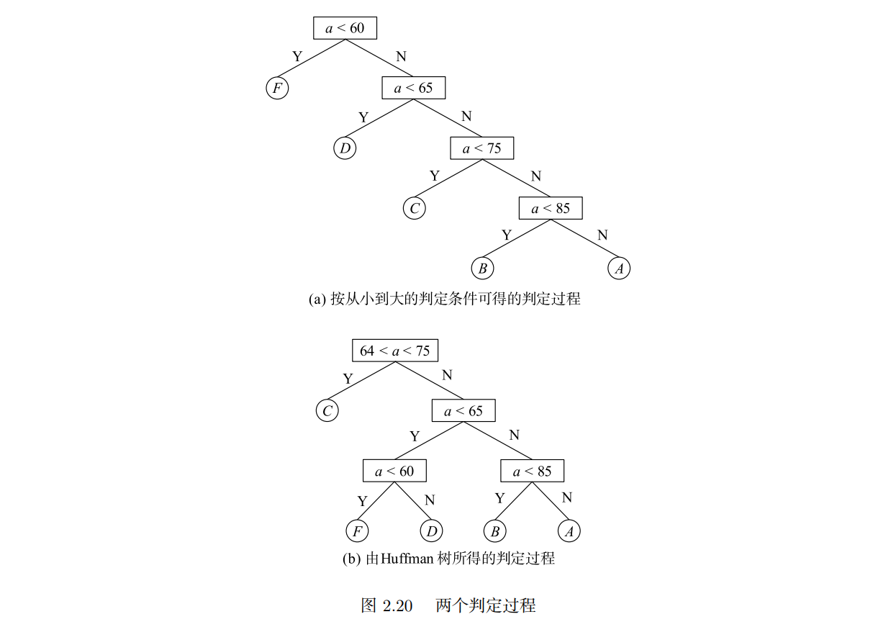

## 常用

### 打开文件

```c
FILE* openfile(const char* filename, const char* mode) {    // 打开文件
    FILE *file = fopen(filename, mode);
    if (file == NULL) {
        printf("\n Error opening file\n");
        return NULL;
    }
    printf("\n File %s opened successfully\n", filename);
    return file;
}
```

### 单链表（另开一页）

功能等待拆分
删除不必要的功能，最后贴上完整代码作为示范

1. 链表结构

```c
struct stu{
    int num;// 内容
    struct stu *next;
};
```

2. 头插法

```c

struct stu *my_head()       //头插法
{
    struct stu *head = NULL,*p = NULL;
    int n = 0;

    printf("\n请输入学生学号(输入-1结束）：");
    scanf("%d",&n);

    while(n != -1){
        p = (struct stu *)malloc(sizeof(struct stu));

        if(p == NULL){      //判断是否申请内存成功，好习惯之一
            printf("error");
            exit(1);
        }

        p->num = n;
        p->next = head;
        head = p;

        printf("\n请输入学生学号(输入-1结束）：");
        scanf("%d",&n);
    }
    return head;
}
```

4. 尾插法

```c
struct stu *back()      //尾插法
{
    struct stu *head = NULL,*rear = NULL,*p = NULL;
    int n = 0;

    printf("\n请输入学生学号(输入-1结束）：");
    scanf("%d",&n);

    while(n != -1){
        p = (struct stu *)malloc(sizeof(struct stu));
        if(p == NULL){
            printf("error");
            exit(1);
        }

        p->next = NULL;
        p->num = n;
        if(!head)
            head = p;
        else
            rear->next = p;
        rear = p;

        printf("\n请输入学生学号(输入-1结束）：");
        scanf("%d",&n);
    }
    return head;
}
```

5. 从文件提取内容

```c
struct stu *fromfile()
{
    void preserve(struct stu *head);    //声明可能会用到的保存函数
    struct stu *head = NULL,*s = NULL,*p = NULL;
    char filename[1024];        //实际并不需要那么多
    FILE *fp;

    printf("请输入您想读入(目前只接受.dat后缀)的文件路径及名称(如D:\\\\student_imformation.dat)\n");
    fflush(stdin);      //刷新缓冲区
    scanf("%s",filename);
    if(!(fp = fopen(filename,"rb"))){   //表明文件不存在,b即binary
        int flag=0; //只在这个语句里用的局部变量

        printf("can't find the file\n");
        printf("你想要现在创建一个吗？(输入0表示不需要)\n");
        scanf("%d",&flag);

        if(!flag){
            fclose(fp);
            return NULL;
        }
        if(flag){
            head = back();  //用尾插法建立，读取更方便
            preserve(head);
            fclose(fp);
            return head;
        }
    }
    //读取文件中的数据
    while(!feof(fp)){
            if(!head){
                p = (struct stu *)malloc(sizeof(struct stu));
                if(p == NULL){
                    printf("error");
                    exit(1);
                }
                lenth++;
                fread(p,sizeof(struct stu),1,fp);
                if(feof(fp)){
                    printf("文件为空\n\n");
                    fclose(fp);
                    return NULL;
                }
             head = s = p;
            }
        p = (struct stu *)malloc(sizeof(struct stu));
        fread(p,sizeof(struct stu),1,fp);

        if(feof(fp)){   //读取结束
            s->next = NULL;
            break;
        }

        s->next = p;
        s = p;
        p->next = NULL;
    }
    fclose(fp);
    printf("已为您读取.dat文件中的内容(可在菜单中选择存为.txt文件)\n");
    return head;

}

struct stu *judge(struct stu *head)    //判断链表是否有序
{
    struct stu *q = NULL,*p = NULL;
    int flag = -1;    //判断是否有序/开关变量
    int f1 = 0,f2 = 0;     //分别代表大于、小于的数量

    p = head;
    if(p != NULL){
        q = p->next;
    }
    while((p != NULL)&&(q != NULL)){
    if((p->num) > (q->num))
        f1++;
    else if((p->num) < (q->num))
        f2++;
    if(f1*f2) {flag=0;break;}   //两者相乘不为零，说明大于和小于同时出现了

        p = p->next;
        q = q->next;
    }
    if(flag == 0) {
        printf("链表无序，您想要排序吗？(不需要请输入0)");
        scanf("%d",&flag);
        if(flag){
            printf("已为您排好升序\n");
            head=my_sort(head);
        }
    }
    return head;
}
struct stu *decision(struct stu *head) //决定在哪里插入
{
    struct stu *p = NULL;
    int i = 0,n = 0;
    p = head;
    printf("您想要在哪里插入(输入*（）*中的序号）：");
    while(p){
        printf("*(%d)*学号:%d  ",i++,p->num);
        p = p->next;
        if(!p) printf("*(%d)*\n",i);
    }
    scanf("%d",&n);
    p = head; //把指针拉回来
    for(i = 0;i < lenth;i++){
        if(n == i)
            break;
        p = p->next;
        if((n != lenth)&&(i == lenth-1)){printf("选择错误！");exit(1);}
    }
    return p;
}
struct stu *my_insert(struct stu *head)    //插入函数 主函数
{
    struct stu *p = NULL,*q = NULL,*temp = NULL;
    p = head;
    head = judge(head);
    p = head;
    q = decision(p);

        temp = (struct stu *)malloc(sizeof(struct stu));
        if(temp == NULL){
            printf("error");
            exit(1);
        }
        printf("\n请输入学生学号：");   //输入要插入的链表的信息
        scanf("%d",&temp->num);
        printf("请输入学生名字:");
        getchar();  //吃空格
        gets((temp->name));
        printf("请输入学生性别");
        gets(&(temp->sex));
        printf("请输入学生年龄");
        scanf("%d",&temp->age);
        printf("请输入学生成绩");
        scanf("%lf",&temp->grade);
        temp->next = NULL;

    p = head;
    if(q == p){  //在表头
        temp->next = head;
        head = temp;
    }
    else if(q == NULL){ //在末尾
        while(p->next) {p = p->next;} //将指针移到表的末尾
        p->next = temp;
    }
    else{
        while(p->next != q) {p = p->next;}
        p->next = temp;
        temp->next = q;
    }
    lenth++;    //表示已经插入了一次,总链表长度增加
    return head;
}
//--------------------------------------------------------------------------------------------------------------------------------
int my_print(struct stu *head)
{
    struct stu *p = NULL;

    p = head;
    while(p){
        printf("\n学号：%d",p->num);
        printf("\n姓名："); puts(p->name);
        printf("性别：");puts(&p->sex);
        printf("年龄：%d\n",p->age);
        printf("成绩：%lf\n",p->grade);
        p = p->next;
    }
    return 2;
}
void preserve(struct stu *head)
{
    struct stu *p = NULL;
    char filename[1024];
    int flag = 0;
    FILE *fp;
    p = head;

    printf("您想存为  txt（1）  文件还是  dat（2）  文件？");
    scanf("%d",&flag);
    printf("请输入您想存入的文件路径及名称(如选择（2）时可写D:\\\\student_imformation.dat)\n");
    scanf("%s",filename);

    if((flag == 1)&&((filename[strlen(filename)-2]) == 'x')){   //x 的意思是，倒数第二个字符为x，也即txt
            if(!(fp = fopen(filename,"w"))){
                printf("开不了\n"); exit(1);
            }
    }
    else if((flag == 2)&&((filename[strlen(filename)-2]) == 'a')){
            if(!(fp = fopen(filename,"wb"))){
                printf("开不了\n"); exit(1);
            }
    }
    else{
        printf("输入不匹配\n\n");
        p = NULL;
    }

    while(p){
            if(flag == 1){
                fprintf(fp,"******************\n学号：%d\n",p->num);
                fprintf(fp,"姓名：");      fputs(p->name,fp);
                fprintf(fp,"\n性别：");    fputs(&p->sex,fp);
                fprintf(fp,"\n年龄：%d\n",p->age);
                fprintf(fp,"成绩：%lf\n",p->grade);
                p = p->next;
            }
            else if(flag == 2){
                fwrite(p,sizeof(struct stu),1,fp);
                p = p->next;
            }
    }
    fclose(fp);
}
void print_choose(struct stu *head)
{
    int flag=0;
    printf("1、屏幕输出\n");
    printf("2、保存链表至文件\n");
    printf("0、返回主菜单\n");
    printf("\n您想选择哪项功能？\n");
    scanf("%d",&flag);

    switch(flag){
        case 1:
            my_print(head);break;
        case 2:
            preserve(head);break;
        default:
            break;      //这一步放给用户了，输入错误也返回主菜单
    }
}
//---------------------------------------------------------------------------------------------------------------------------------
struct stu *my_search(struct stu *head,int n,int flag)
{
    struct stu *p = NULL,*q = NULL; //q用于暂时存储节点
    int len = 0;  //len用于判断函数是否是被多次调用
    p = head;

    while(p){
        if((p->num) == n){
            if(flag == 5) {     //表示此时在 choose函数中被使用
                q = p->next;    //本程序中自定义的输出函数会输出后续所有的链表
                p->next = NULL; //所以用q来存储断开的节点，将p设置为最后一个节点
                my_print(p);
                p->next = q;      //将链表还原
            }
            return p;
        }
        p = p->next;    //移动指针
        len++;
    }
    if(((flag == 5)||(flag == 6))&&(len == lenth)) //表明是查询或者第一次删除
        printf("\n您查询的学号不存在\n");    //能走到这一步肯定就是找不到了
    return NULL;
}
struct stu *my_delete(struct stu *head)
{
    struct stu *shead = NULL;
    struct stu *p = NULL,*t = NULL;  //用于暂时存储节点
    int n = 0;    //n即num
    int flag = 6;     //判断是第几次调用search函数(值为6时表示第一次）
    printf("\n请输入您要删除的学号：");
    scanf("%d",&n);

    shead = (struct stu *)malloc(sizeof(struct stu));
    shead->next = head; //虚拟头节点
    shead->num = -1;    //初始化
    p=shead;
    while(p->next != NULL){       //当移动到链表末尾时结束

        if(p->next->num == n){
            t = p->next;
            p->next = p->next->next;
            lenth--;    //说明已经完成了一次删除
        }
        else {p = p->next;}
    }
    head = shead->next;
    free(shead);
    return head;
}

void choose()
{
    int n = 1,inum = 0;    //用于选择功能
    static int count = 0;
    struct stu *head = NULL;
    struct stu *p = NULL;    //只用于多次调用my_search函数,其实可以直接在函数里的while里解决，找到一个输出一个，可以减少不少代码量和复杂度

    while(n){

    menu();     //展示菜单
    printf("\n请选择功能：");
    scanf("%d",&n);
    if((count == 0)&&(n != 1)&&(n != 0)&&(n != 9)) {n = -1;} //第一次只能先建立链表、清屏或者退出

        switch(n){
            case 1:
                head = my_make();break;   //以下三个函数都会改变head
            case 2:
                head = my_insert(head);break;
            case 3:
                head = my_delete(head);break;
            case 4:
                print_choose(head);break;
            case 5:
                p = head;
                printf("\n请输入您要查询的学号：");
                scanf("%d",&inum);
                while(p){       //可能出现多个相同学号
                   p = my_search(p,inum,n);
                   if(!p) break;    //查不到时指针为空，p->next未知,故if要放在前一步
                    p = p->next;
                }
                break;
            case 6:
                head = my_sort(head);break;
            case 9:
                system("cls");break;            //函数存在 stdlib.h 头文件中，不需要再写
            default:
                if(n != 0) printf("输入错误\n");
        }
        if(n == -1)
            count = 0;      //保险起见加一个赋值，无伤大雅
        else if(head)
            count++;    //第一步的  必选   限制解除
     }
     printf("\n\n程序结束\n");

}
void main()
{
    printf("More features await development!\n\n");
    choose();
}

```

### 静态链表

```c

```

### 哨兵节点

```c

```

### 字典树

```c

```

### 不使用辅助数组，分离顺序表中的奇偶数

（124567 $\rightarrow 157246$）

```c

```

### 秘书问题

只检索一遍，给出使得找到最大值概率最大（37%）的算法

```c

```

## 搜索

### 分治法找到数组给定范围中的最大值

数组 array，搜索范围( left,right )，m 为分割位置

```c
int findMaximun(int array[],int left,int right){
    m = (left + right) / 2;     // 分割
    if(left == right){          // 只有一个元素
        return array[left];
    }
    else{
        int u = findMaximun(array,left,m);  // 分治解决前半部分
        int v = findMaximun(array,m,right); // 分治解决后半部分
        x = (u > v) ? u : v;
        return x;
    }
}
```

### 启发式搜索

```c

```

### 递归找出数组全部子集

```c

```

### gitmask 找出全部子集

```c

```

### 回溯法找出 n 个物品中权值总和为 T 的全部子集

数组每个元素只与排在它后面的元素构成分支，避免产生重复子集影响效率和准确性；
搜索途中超出范围则剪去分支，减少搜索量；

```c
void backtrack(const int data[],int target[],int n,int T,int count,int total){
    if (total == T){        // 满足条件，输出并结束分支（未必要将分支走完，如8,2,5,3,其中到2便可以返回）
        Print(data,target, n);
        return;
    }
    if (total > T || count == n){   // 分支中途和超出范围或者分支寻找结束
        return;     // 返回上一层
    }
    target[count] = 1;  // 先标记，代表这一层内这个位置的数字被用到了
    backtrack(data,target,n,T,count+1,total+data[count]);   // 加上这个节点的值，进入下一层
    target[count] = 0;  // 违背上面的if条件，回退，不把这个数据加进去，
    backtrack(data,target,n,T,count+1,total);               // 深度优先，count每次只走一步，更安全
    // 如果此时还找不到会自动回溯
}
```

### DFS 找出迷宫的所有通路

```c

```

### BFS 找出迷宫最优解

```c

```

### “左手摸墙”找一个迷宫可行解

```c

```

## 排序

### 快速排序

```c

```

### 归并排序

```c

```

### 堆排序

```c

```

### 希尔排序

```c

```

### 选择排序

```c

```

### 冒泡排序

```c

```

### 猴子排序

误

## 分类

### Hafuman 树为成绩分等级

85~100 A
75~84 B
65~74 C
60~64 D
<60$ \quad $E
若全使用条件判断语句，正常情况下，80%的数据需要判断 3 次以上（假设大于 65 分的人数约占 80%）
判断次数： 1F + 2D + 3C + 4B + 5A 次，
而使用哈夫曼树可以提高约 31%的效率
示例：

